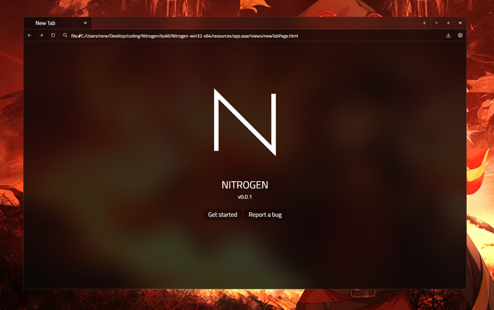
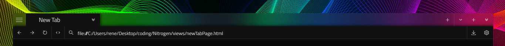
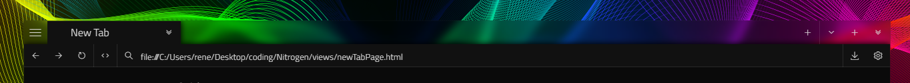
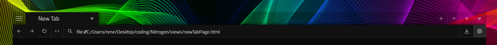
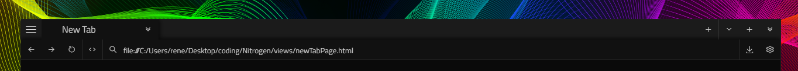

# Nitrogen
A beautiful web browser written in javascript.

Under active development.

# Discord Rich-Presence by [shinixsensei-dev](https://github.com/shinixsensei-dev)

## How to install
------
Windows users: Head over to the [releases page](https://github.com/rmcproductions/nitrogen/releases) and download the latest .exe.

To build yourself:
* Clone or download the repository.
* `npm i` ⚠ WARNING: The `npm i` command will also install the package 'ewc'. To build it, you will have to install the packages 'windows-build-tools' (`npm i -g windows-build-tools --vs2015` inside an administrator powershell)  and 'node-gyp'. The 'ewc' module is responsible for the background blur which currently only works on windows. I will add it as an optional dependency in the future to provide support for mac and linux.
* `npm start`
* Enjoy!

## Screenshots
------
Main window

### Different blur types
Acrylic

BlurBehind

Transparent

Solid

